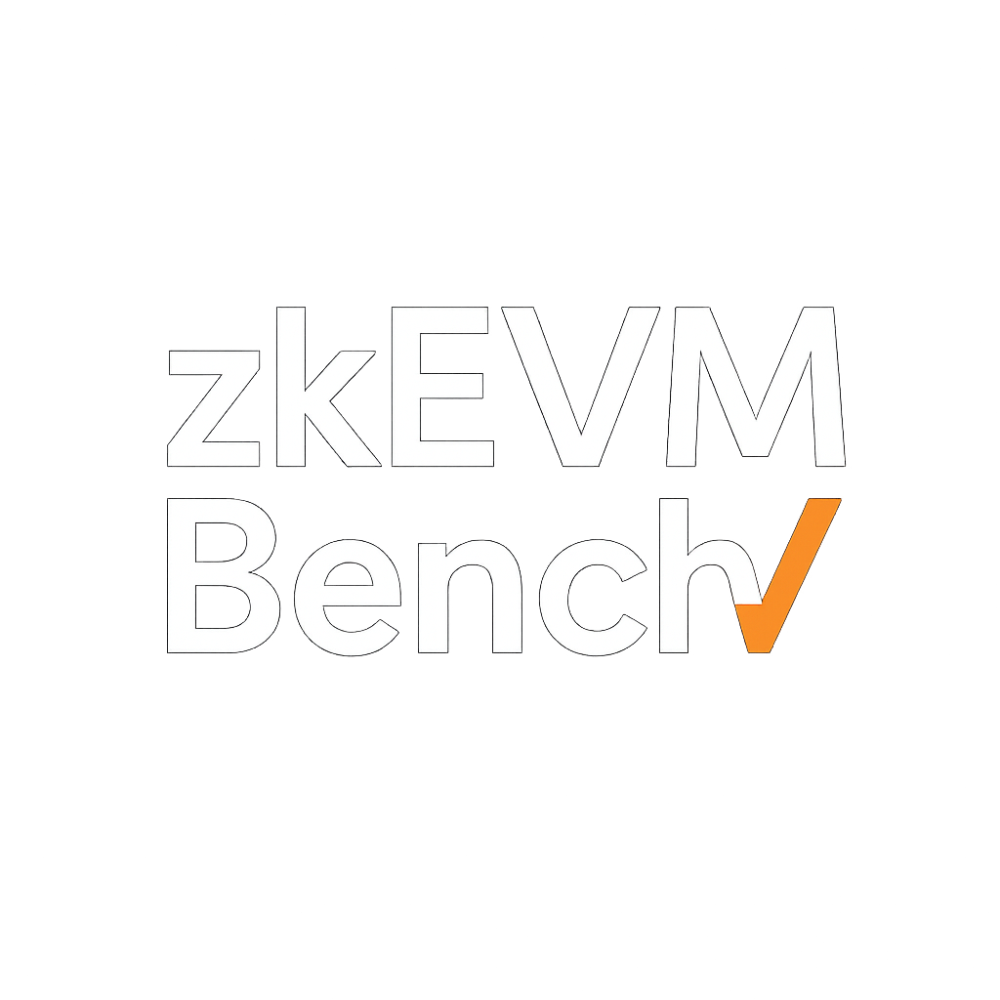

<p align="center">
  
</p>

<h1 align="center">zkEVM Benchmarking Workload</h1>

This repository benchmarks Ethereum stateless-validator guests across multiple zkVMs. The normal workflow has two phases:

1. Obtain canonical EEST `blockchain_tests` fixtures containing `statelessInputBytes` and `statelessOutputBytes`.
2. Pass a fixture file, fixture directory, or EEST fixture checkout to `ere-hosts` and write execution metrics, proofs, or verification results.

## Workspace At a Glance

- **`crates/ere-hosts`**: benchmark CLI for execution, proving, and verification jobs.
- **`crates/benchmark-runner`**: shared orchestration for canonical fixture loading, guest resolution, execution, proof flow, and verification.
- **`crates/metrics`**: serializable result types such as `BenchmarkRun`.
- **`crates/witness-generator-spec-cli`**: separate CLI and library for producing and publishing benchmark-ready EEST stateless fixtures from CL/EL RPC endpoints.

Reth `v0.1.0-rc.2` and Ethrex `v26.0.0-rc.2` are enabled across OpenVM, SP1,
and ZisK. Zesu remains a valid CLI choice but fails early because `ere-guests`
has no active tests-zkevm v0.8.2 artifacts for it. Guest programs are maintained
in [eth-act/ere-guests](https://github.com/eth-act/ere-guests). The current
pinned commit resolves artifacts from GitHub Actions and requires `GITHUB_TOKEN`
or `GH_TOKEN`; `--bin-path` and `--guest-artifact-base-url` remain available for
Reth and Ethrex overrides.

## Prerequisites

- Rust via `rustup`
- Docker
- Canonical EEST `blockchain_tests` fixtures

## Quickstart

Inspect both maintained CLIs:

```bash
cargo run -p ere-hosts -- --help
cargo run -p witness-generator-spec-cli -- --help
```

The witness generator produces benchmark-ready EEST fixtures from live CL/EL
networks. Use `generate` for one block or `collect` for continuous per-block
collection. Exported live batches contain a `blockchain_tests/` tree and can be
passed to `ere-hosts` immediately after extraction.

Obtain the
[`tests-zkevm-benchmark@v0.8.2`](https://github.com/ethereum/execution-specs/releases/tag/tests-zkevm-benchmark%40v0.8.2)
fixture bundle, whose `blockchain_tests` cases contain canonical stateless
bytes. Then benchmark either the extracted fixture root, a directory of EEST
JSON files, or one EEST JSON file:

```bash
cargo run -p ere-hosts --release -- --zkvms sp1 \
    stateless-validator --execution-client reth \
    --input-folder /path/to/execution-specs/fixtures
```

Execute and prove actions require `--input-folder`. Verification reads saved proofs and may omit it.

## Guides

- [Documentation map](docs/README.md)
- [Benchmark execution, proofs, and verification guide](docs/benchmark-execution.md)
- [Benchmark input reference](docs/benchmark-execution-inputs.md)
- [Benchmark output reference](docs/benchmark-execution-output.md)
- [Stateless input publication guide](docs/stateless-input-publication.md)

The root README is intentionally short. Detailed workflow documentation lives under `docs/`.

## License

Licensed under either of

* MIT license (LICENSE-MIT or [http://opensource.org/licenses/MIT](http://opensource.org/licenses/MIT))
* Apache License, Version 2.0 (LICENSE-APACHE or [http://www.apache.org/licenses/LICENSE-2.0](http://www.apache.org/licenses/LICENSE-2.0))

at your option.
